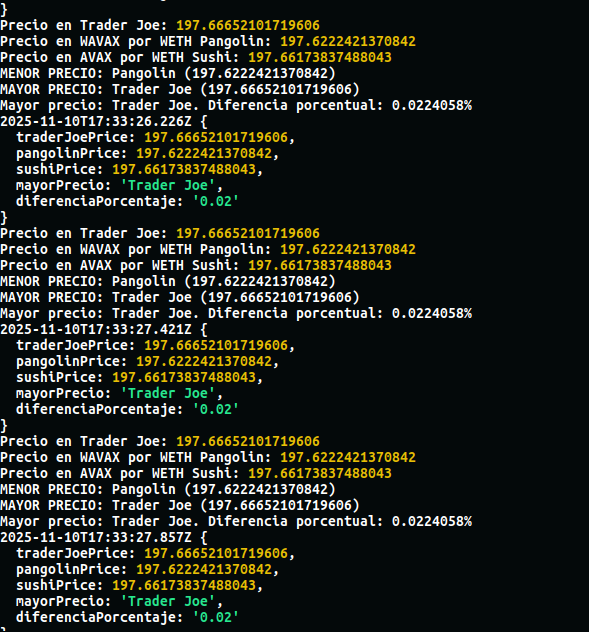

# Avalanche WETH <-> WAVAX Arb Scan

Point it at the public RPC below (or your own favorite endpoint), load the environment variables, and it will start streaming prices straight from the C-Chain.

## Quick Start

1. Create a new `.env`.
2. Fill in the variables listed in the table below (custom RPC endpoints work fine as long as they speak Avalanche C-Chain).
3. Install dependencies with `yarn`.
4. Run the scanner with `node index.js` 

## Environment Variables

| Name | Default / Example | Description |
| --- | --- | --- |
| `MAINNET_RPC_PROVIDER` | `https://api.avax.network/ext/bc/C/rpc` | Public Avalanche RPC; feel free to plug in any compatible C-Chain RPC. |
| `AVAX_NETWORK` | `api.avax.network` | Hostname used for RPC health checks. |
| `CHAIN_ID` | `43114` | Avalanche C-Chain ID. |
| `BC` | `mainnet` | Network tag used inside scripts/logging. |
| `TRADER_JOE_PAIR_WETH_WAVAX_MAINNET` | `0xFE15c2695F1F920da45C30AAE47d11dE51007AF9` | Trader Joe WETH/WAVAX LP. |
| `SUSHISWAP_PAIR_WETH_WAVAX_MAINNET` | `0x7c05d54fc5CB6e4Ad87c6f5db3b807C94bB89c52` | SushiSwap WETH/WAVAX LP. |
| `PANGOLIN_PAIR_WETH_WAVAX_MAINNET` | `0x2fde1c280a623950b10b6483b9a0c23549c9b515` | Pangolin WETH/WAVAX LP. |
| `TRADERJOE_LBR_ROUTER_ADDRESS` | `0xb4315e873dBcf96Ffd0acd8EA43f689D8c20fB30` | Trader Joe LBP/Limit router. |
| `SUSHISWAP_ROUTER_ADDRESS` | `0x1b02dA8Cb0d097eB8D57A175b88c7D8b47997506` | SushiSwap router. |
| `PANGOLIN_ROUTER_ADDRESS` | `0xE54Ca86531e17Ef3616d22Ca28b0D458b6C89106` | Pangolin router. |
| `WETH_ADDRESS` | `0x49D5c2BdFfac6CE2BFdB6640F4F80f226bc10bAB` | Wrapped Ether on Avalanche. |
| `WAVAX_ADDRESS` | `0xB31f66AA3C1e785363F0875A1B74E27b85FD66c7` | Wrapped AVAX. |

> Tip: if you run multiple scanners, give each its own RPC provider to avoid rate limits.

## Running Scripts

- `node index.js` — baseline scanner that polls all pools and logs price spreads.

## TODO

Add liquid trade-size
- `node dexInteractions.js` — direct call helper for individual DEX reads/writes.

## Troubleshooting

- Missing ENV: double-check `.env` is loaded before launching the script.
- Weird prices: confirm pool addresses match mainnet

Happy hunting on the C-Chain!
